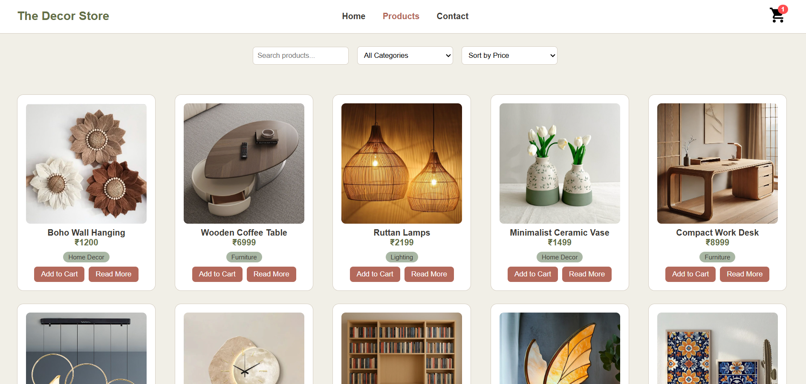
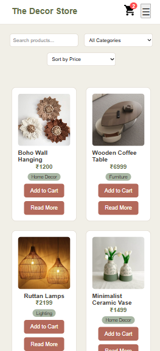
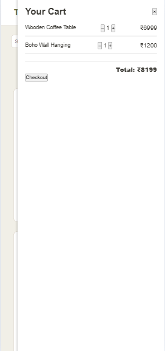

# task-8

**The Decor Store - Add to Cart Functionality**

Built using HTML, CSS, and JavaScript. This task simulates a real-world e-commerce cart system entirely on the frontend. Users can add items to the cart, view selected products in a cart sidebar, remove items, and see total price — all without a backend. Cart data is saved using `localStorage`, so it stays even after refreshing the page.

---

# Live Demo

[🔗 View Live](https://lisha2804.github.io/task8/)

---

# Screenshots

### Desktop View

### Mobile View

---
